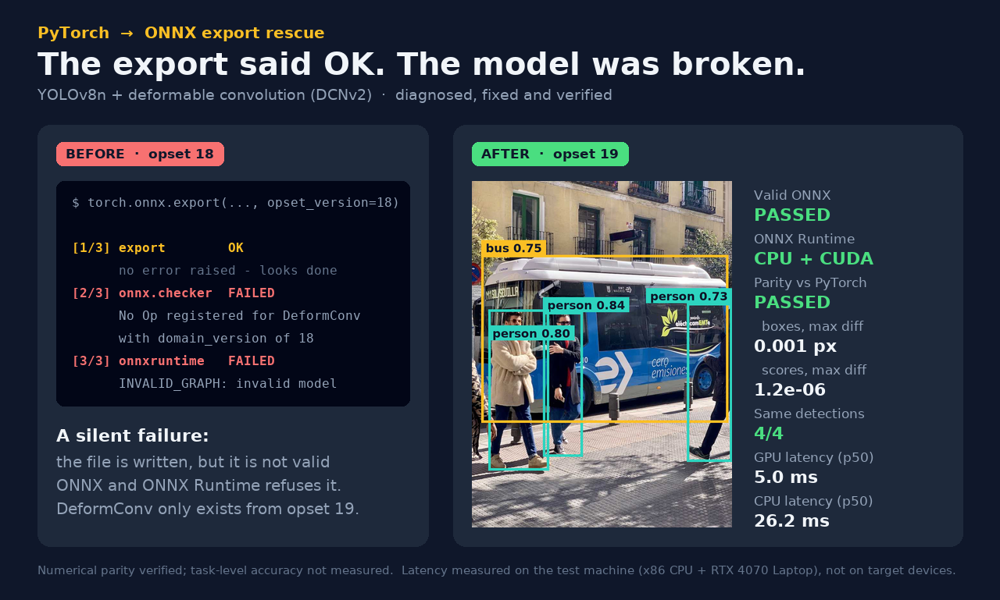

# Case 01 — "The export said OK. The model was broken."

**YOLOv8n + deformable convolution (DCNv2) → ONNX: a silent export failure, diagnosed, fixed and verified.**



| | |
|---|---|
| **Symptom** | `torch.onnx.export` finishes without any error and writes a 13 MB `.onnx` file. ONNX Runtime refuses to load it: `INVALID_GRAPH ... No Op registered for DeformConv with domain_version of 18`. |
| **Root cause** | `torchvision.ops.DeformConv2d` maps to the ONNX operator `DeformConv`, which only exists from **opset 19** onwards. At opset 18 the exporter still writes the node — the file is invalid ONNX, but nothing fails until someone tries to use it. |
| **Fix** | One argument: `opset_version=18` → `opset_version=19`. |
| **Verification** | Valid ONNX (full checker), runs on ONNX Runtime CPU **and** CUDA, numerical parity with PyTorch on a random input and a real photo, identical detections (4/4). |

---

## Reproduce it (≈ 5 minutes)

Run every command from the repository root.

```bash
python -m venv .venv
# Windows: .venv\Scripts\activate      Linux/macOS: source .venv/bin/activate
pip install -r requirements.txt

python build_model.py        # builds the DCN model from the official yolov8n.pt (downloaded once)
python reproduce_error.py    # BEFORE: export "succeeds", checker + ONNX Runtime reject the file
python export_fixed.py       # AFTER: opset 19 + 4-step verification
python make_visual.py        # draws the before/after image from the evidence files
```

What you should see:

```text
# reproduce_error.py
[1/3] export        OK - no error raised, before_opset18.onnx written (13.4 MB)
[2/3] onnx.checker  FAILED: No Op registered for DeformConv with domain_version of 18 ...
[3/3] onnxruntime   FAILED: [ONNXRuntimeError] : 10 : INVALID_GRAPH ...
RESULT: reproduced.

# export_fixed.py
[1/4] export        OK - after_opset19.onnx (13.4 MB)
[2/4] onnx.checker  OK - valid opset-19 model, 3 DeformConv nodes
[3/4] onnxruntime   OK - CPU runs; CUDA: ok            ("not available" on CPU-only setups)
[4/4] parity bus.jpg      PASSED - cosine 1.00000000 | boxes max |diff| 1.5e-03 px | scores max |diff| 1.2e-06
      detections on bus.jpg: PyTorch 4, ONNX 4, matched 4/4
RESULT: fixed and verified.
```

The last digits of the parity numbers vary slightly between CPUs; the verdicts do not.

## The model

A very common community modification: the 3×3 convolution inside every C2f bottleneck of YOLOv8n's deep backbone stages (layers 6 and 8) is replaced by `torchvision.ops.DeformConv2d` (DCNv2, with modulation mask) — 3 layers in total. The deformable layers start from the original pretrained weights.

**Honesty note:** the new offset/mask branches are *calibrated random initialisation* (offsets ≈ 0.5 px RMS, mask ≈ 0.95), **not trained weights**. This case is about export behaviour, not accuracy. The modified model still finds 4 of the 5 objects the original yolov8n finds on `bus.jpg` (it loses a low-confidence, half-visible person at the image edge).

## Why this fix, and what else was considered

| Option | Result | Decision |
|---|---|---|
| **Export at opset 19** (native `DeformConv`) | Valid, runs on ONNX Runtime 1.27 CPU and CUDA, parity passes | **Used** — smallest change, fully verified |
| Re-implement DeformConv with standard ops (`grid_sample` + 1×1 conv) to stay on opset 18 | Numerically equivalent to torchvision (max diff ≈ 2e-6), but with torch 2.11 it currently exports only through the legacy TorchScript exporter | Kept as a fallback for runtimes that do not implement `DeformConv` |

## Verification details

| Check | Result |
|---|---|
| `onnx.checker` (full_check) | passed — opset 19, 3 `DeformConv` nodes |
| ONNX Runtime 1.27 | CPU ✓ · CUDA ✓ (CPU fallback disabled, so a silent fallback cannot hide a gap) |
| Parity — random input | cosine 1.00000000 · boxes max diff 5.5e-4 px · scores max diff 1.8e-7 |
| Parity — `bus.jpg` | cosine 1.00000000 · boxes max diff 1.5e-3 px · scores max diff 1.2e-6 |
| Detections on `bus.jpg` | PyTorch 4 · ONNX 4 · matched 4/4 |
| Latency (p50, batch 1, n = 100) | RTX 4070 Laptop GPU **5.0 ms** · x86 CPU **26.2 ms** |

Latency was measured on the test machine only (x86 CPU + RTX 4070 Laptop, ONNX Runtime, input/output copies included). It says nothing about Jetson, Raspberry Pi or any other target device.

## Two findings along the way

**1. A single "max abs diff" threshold is unit-blind for YOLO outputs.** The output `[1, 84, 8400]` mixes box coordinates in pixels (0–640) with class scores (0–1). Float32 rounding on a 637 px coordinate is ~1e-3 px, so a generic `max_abs_diff ≤ 1e-3` check can "fail" a perfectly correct model on a real photo — the *unmodified* yolov8n shows ~1.4e-3 as well. `export_fixed.py` therefore judges each part in its own unit (boxes ≤ 0.01 px, scores ≤ 1e-3, plus cosine and a detection-level match).

**2. On ultralytics 8.4, a yolov8n rebuilt from `yolov8n.yaml` does not behave like the pretrained `yolov8n.pt` — even with identical weights.** Outputs diverge from the SPPF block (layer 9) onwards because a non-weight setting of that block changed in newer versions. `dcn_yolo.py` therefore builds the architecture from the official `.pt`, never from the yaml.

## What was NOT tested

- Task-level accuracy (mAP) — no dataset was used; only numerical parity was verified.
- Runtimes other than ONNX Runtime 1.27 (e.g. TensorRT, OpenVINO, TFLite, mobile runtimes), and any target device.
- Dynamic input shapes or batch sizes other than 1 — the export uses a fixed `1×3×640×640` input.

## Files

| File | Purpose |
|---|---|
| `dcn_yolo.py` | Model definition; `get_model(weights)` is the single loading entry point |
| `build_model.py` | Builds `weights/dcn_yolov8n.pth` deterministically from the official `yolov8n.pt` |
| `reproduce_error.py` | The failing export (opset 18) and its evidence → `outputs/before_log.txt` |
| `export_fixed.py` | The fix (opset 19) and its 4-step verification → `outputs/after_report.json` |
| `make_visual.py` | Before/after image, built only from the evidence files |
| `yolo_post.py` | Letterbox, YOLO decoding + NMS, detection matching |

Tested with Python 3.11.9 (Windows 11) and 3.12 (Linux) · torch 2.11.0 · torchvision 0.26.0 · onnx 1.22.0 · onnxruntime(-gpu) 1.27.0 · ultralytics 8.4.115.

## License

AGPL-3.0 — this case builds on [Ultralytics YOLOv8](https://github.com/ultralytics/ultralytics), which is AGPL-3.0.
